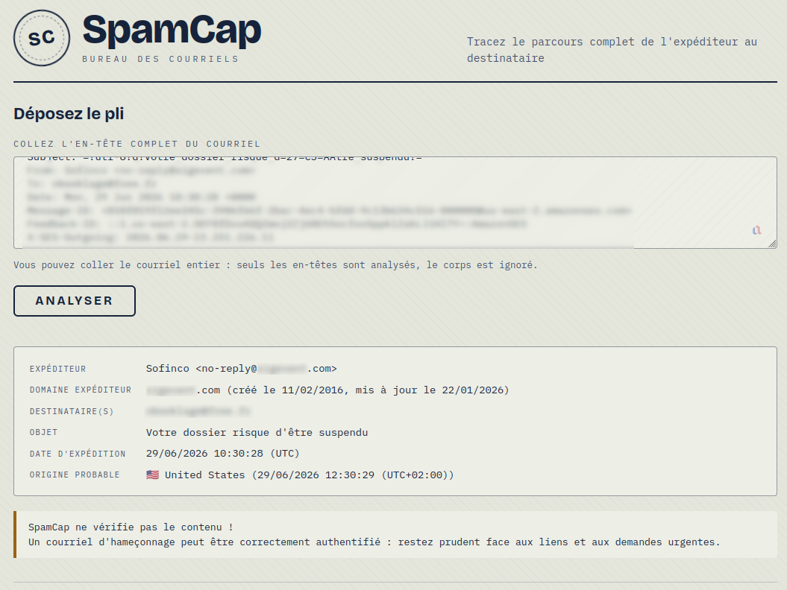
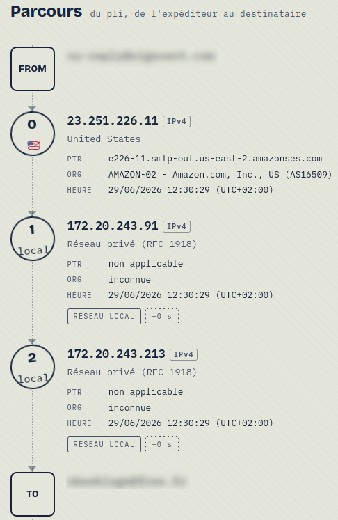

# SpamCap

**Page de présentation : https://obook.github.io/spamcap/**

Analyseur d'en-têtes de courriel avec visualisation du parcours et détection
d'usurpation.

Collez l'en-tête brut d'un courriel reçu et SpamCap reconstitue son parcours,
serveur par serveur, puis signale les incohérences et les usurpations lisibles
dans les en-têtes. L'analyse porte sur l'acheminement, jamais sur le contenu.

## Aperçu



*Saisie de l'en-tête et carte d'identité : expéditeur, âge du domaine, origine
probable et avertissement permanent.*



*Le parcours, de l'expéditeur (FROM) aux serveurs traversés jusqu'au
destinataire (TO).*

## Fonctionnalités

- Parcours en timeline verticale, de l'expéditeur aux serveurs jusqu'au
  destinataire, reconstruit à partir des champs `Received:`.
- Par saut : IP (v4 ou v6) ou nom d'hôte, DNS inverse (PTR) ou mention claire
  d'absence de reverse, pays et ville, organisation (ASN), horodatage et délai.
  Un saut sans IP est géolocalisé via le DNS actuel de son nom d'hôte.
- Réputation de chaque IP sur les listes noires DNS (SpamCop SCBL, Spamhaus ZEN).
- Authentification : résultats SPF, DKIM et DMARC.
- Verdict du filtre de réception du fournisseur (Microsoft 365, SpamAssassin).
- Détection d'incohérences et d'usurpation : horodatages incohérents, IP privée
  insérée entre des relais publics, nom affiché trompeur, domaine sosie
  (punycode), désalignement DMARC, adresse de réponse divergente.
- Carte d'identité du courriel : expéditeur, destinataire(s), objet, date
  d'expédition (heure de l'expéditeur) et origine probable.
- Avertissement permanent : un courriel d'hameçonnage peut être techniquement
  authentifié, car le contenu n'est pas analysé.

Aucun courriel n'est conservé. Le traitement est sans état et s'exécute
entièrement en mémoire ; le corps du courriel n'est jamais transmis au serveur.

## Prérequis

- [uv](https://astral.sh/uv) pour la gestion de Python et des dépendances.
- Python 3.12 (installé automatiquement par uv depuis `.python-version`).
- Une base MaxMind GeoLite2 City pour la géolocalisation (optionnelle :
  l'application démarre sans elle et renvoie des champs géographiques vides).
  Voir la section GeoIP plus bas.

## Installation

```bash
git clone https://github.com/obook/spamcap.git
cd spamcap
uv sync
```

`uv sync` crée l'environnement virtuel et installe chaque dépendance depuis
`uv.lock`, garantissant une installation reproductible.

## Lancement

Le script `launch.sh` enveloppe le serveur dans les deux modes :

```bash
./launch.sh          # développement, rechargement auto, 127.0.0.1:8000
./launch.sh prod     # production, 0.0.0.0:8000
```

`HOST` et `PORT` surchargent les valeurs par défaut, par exemple
`PORT=9000 ./launch.sh`.

Les commandes directes équivalentes sont :

```bash
uv run uvicorn backend.main:app --reload
uv run uvicorn backend.main:app --host 0.0.0.0 --port 8000
```

L'application est alors accessible sur http://127.0.0.1:8000.

En production, derrière Nginx en proxy inverse devant Uvicorn. Les détails de
déploiement sont documentés dans `SPEC.md`.

## Base GeoIP

La géolocalisation repose sur la base MaxMind GeoLite2 City, qui n'est pas
fournie avec le dépôt. Téléchargez `GeoLite2-City.mmdb` dans `data/` à l'aide
d'un compte MaxMind gratuit et d'une clé de licence. Un script d'aide est fourni :

```bash
MAXMIND_LICENSE_KEY="votre_cle" scripts/download_geoip.sh
```

Le chemin de la base est surchargeable par la variable `SPAMCAP_GEOIP`. Sans
cette base, SpamCap fonctionne quand même et renvoie `null` pour le pays et la
ville.

## Organisation du projet

```
backend/    Service FastAPI : analyse, résolution, détection, modèles
frontend/   Interface monopage (HTML, CSS, JavaScript vanilla)
scripts/    Téléchargement de la base GeoIP
data/        Base GeoLite2 (non versionnée)
SPEC.md      Spécification fonctionnelle et critères de détection
```

## Licence

SpamCap est distribué sous Licence Ouverte 2.0 (Etalab). Voir le fichier
`LICENSE`. Vous êtes libre de réutiliser, modifier et redistribuer le code, y
compris à des fins commerciales, sous réserve de mentionner la paternité :
auteur Olivier Booklage, et la date de dernière mise à jour.
